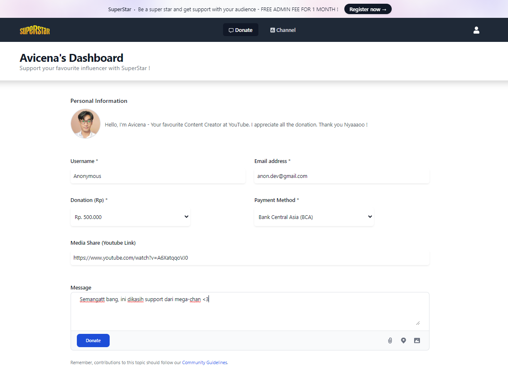
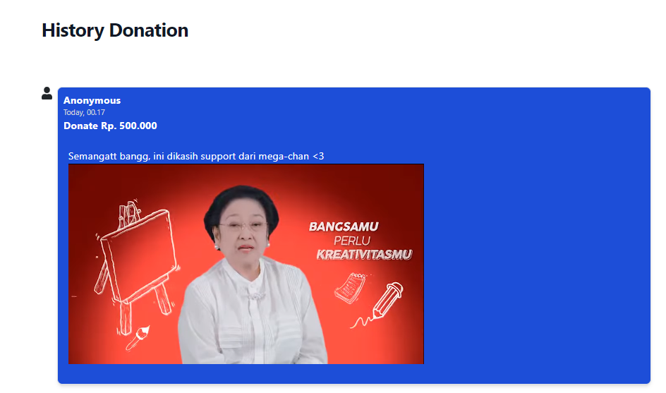

<h1 align="left">Welcome to SuperStar: Empower Your Influencers, Ignite Their Dreams!  </h1>

Are you ready to revolutionize the way you support your favorite influencers? Look no further than SuperStar – the ultimate donation app designed to elevate content creators and fuel their passion for creativity. Hi, I'm Muhammad Avicena, the founder of SuperStar, and I'm thrilled to introduce you to a platform that empowers both influencers and their devoted supporters.

I am committed to staying up-to-date with industry trends and using the latest tools to develop innovative solutions that surpass expectations.
Interested to have collaboration ? Find me on:

## STRUCTURE 📰

- Header
  - Navbar
- Main
  - Dashboard Donation
    - Forms text
  - History Donation 

## INGREDIENTS I USE 📜
- HTML
- CSS
- JavaScript/Typescript
- External/Internal Source
  - Icon
  - Image
  - TailwindCSS
  - Bootstrap

## FEATURE 📰

1. You can donate your favourite influencer.
2. You can customize your media share integrated with youtube that will be shown in the popup.
3. Responsive app with mobile/pc version.

## DEPLOYMENT ⚙️

The project has been successfully deployed using Netlify. You can access the production version of the website by following this link: [https://superstar.avicena.dev](https://superstar.avicena.dev).

Feel free to explore the website and try out the different features. I appreciate any feedback and suggestions to further improve the user experience.

Happy browsing!
